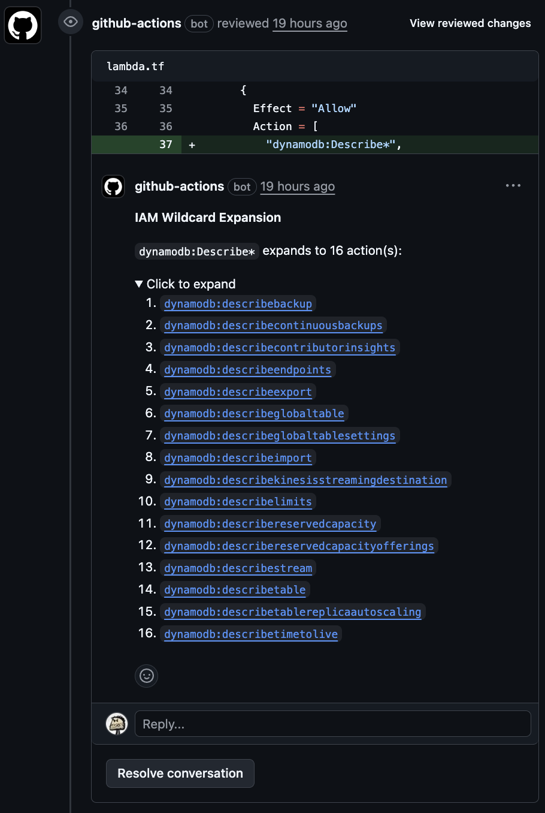

# Expand AWS IAM Wildcards

[](https://github.com/thekbb/expand-aws-iam-wildcards/actions/workflows/ci.yml)
[](https://codecov.io/gh/thekbb/expand-aws-iam-wildcards)
[](https://opensource.org/licenses/MIT)

Automatically expands IAM wildcard actions in PR diffs and posts inline comments showing what
each wildcard matches, with links to AWS docs.

The goal is to make it easier and faster for reviewers to understand changes to security posture with inline comments
like this:



## Recommended Workflow

```yaml
# .github/workflows/iam-wildcards.yml
name: Expand IAM Wildcards

on:
  pull_request:

permissions: {}

jobs:
  expand:
    permissions:
      pull-requests: write
    runs-on: ubuntu-latest
    steps:
      - uses: thekbb/expand-aws-iam-wildcards@5c532fe1c93e7f81e1c311441a17db36d018c128 # v1.2.2
```

That is the recommended setup:

- trigger on `pull_request`, not `pull_request_target`
- grant only `pull-requests: write` to the job that runs this action
- use a full 40-character commit SHA if you want an immutable workflow reference
- keep the release tag in a trailing comment so humans can see the intended version quickly

No checkout step is required. The action reads the PR diff through the GitHub API and posts inline review comments
back to the pull request.

## What It Does

When your PR introduces:

```hcl
"s3:Get*Tagging",
```

The action posts an inline comment:

> **IAM Wildcard Expansion**
>
> `s3:Get*Tagging` expands to 5 action(s):
>
> 1. [`s3:GetBucketTagging`](https://docs.aws.amazon.com/service-authorization/latest/reference/list_amazons3.html)
> 2. [`s3:GetJobTagging`](https://docs.aws.amazon.com/service-authorization/latest/reference/list_amazons3.html)
> 3. [`s3:GetObjectTagging`](https://docs.aws.amazon.com/service-authorization/latest/reference/list_amazons3.html)
> 4. [`s3:GetObjectVersionTagging`](https://docs.aws.amazon.com/service-authorization/latest/reference/list_amazons3.html)
> 5. [`s3:GetStorageLensConfigurationTagging`](https://docs.aws.amazon.com/service-authorization/latest/reference/list_amazons3.html)

Consecutive wildcards are grouped into a single comment. Expanded actions link to AWS documentation.
Very large expansions are truncated in the PR comment to stay within GitHub comment limits,
and the full list is written to the workflow run logs.

## Inputs

| Name                  | Description                                          | Default                         |
| --------------------- |------------------------------------------------------| ------------------------------- |
| `github-token`        | GitHub token for API access                          | `${{ github.token }}`           |
| `file-patterns`       | Glob patterns to scan (comma-separated)              | See below                       |
| `collapse-threshold`  | Number of actions before collapsing into `<details>` | `5`                             |

Default file patterns: `**/*.json,**/*.yaml,**/*.yml,**/*.tf,**/*.ts,**/*.js`

## Usage Examples

### Terraform Only

```yaml
- uses: thekbb/expand-aws-iam-wildcards@5c532fe1c93e7f81e1c311441a17db36d018c128 # v1.2.2
  with:
    file-patterns: '**/*.tf,**/*.tf.json'
```

### CloudFormation Only

```yaml
- uses: thekbb/expand-aws-iam-wildcards@5c532fe1c93e7f81e1c311441a17db36d018c128 # v1.2.2
  with:
    file-patterns: '**/*.yaml,**/*.yml,**/*.json'
```

## Update Strategy

For security, prefer a full 40-character commit SHA over a moving tag such as `@v1`. GitHub recommends full-length
commit SHAs as the immutable option for third-party actions in its
[Secure use reference](https://docs.github.com/en/actions/reference/security/secure-use). If you want automatic
updates while still using immutable workflow references, enable Dependabot for GitHub Actions in your repository:

```yaml
# .github/dependabot.yml
version: 2
updates:
  - package-ecosystem: 'github-actions'
    directory: '/'
    schedule:
      interval: 'weekly'
```

Dependabot updates workflow `uses:` references in `.github/workflows`, including commit SHAs for GitHub Actions. The
trailing `# v1.2.2` comment is mainly for human review so maintainers can see which release a referenced SHA
corresponds to. Dependabot should keep that comment aligned when it updates the SHA, but the comment is
informational, not security-critical.

Published GitHub releases in this repository are immutable starting with `v1.2.1`. That means a release-specific tag
such as `@v1.2.1` cannot be retargeted on GitHub after publication. The major tag `@v1` remains intentionally movable
so it can track the latest compatible `v1` release. For GitHub's model for combining immutable releases with movable
major tags, see
[Using immutable releases and tags to manage your action's releases](https://docs.github.com/en/actions/how-tos/create-and-publish-actions/using-immutable-releases-and-tags-to-manage-your-actions-releases).

## Release Process

Published releases are prepared and verified in GitHub Actions on Ubuntu.

1. Run the `Prepare Release` workflow with the source ref and target version.
1. Review and merge the resulting `release-candidate/vX.Y.Z` pull request.
1. Create a signed `vX.Y.Z` tag from that merged commit.
1. Create a draft GitHub release for the tag.
1. Run the `Verify Draft Release` workflow with that tag.
1. If verification succeeds, the workflow will generate an OIDC-backed attestation for
   `dist/index.js` and publish the draft release.

## How It Works

1. Fetches the PR diff
1. Scans added lines for IAM wildcard patterns (`service:Action*`)
1. Expands wildcards against the bundled IAM action list generated from [@cloud-copilot/iam-data](https://github.com/cloud-copilot/iam-data)
1. Posts inline review comments with links to AWS docs
1. Reuses or updates existing bot comments in place when the anchor still matches, to reduce comment churn

## Security & Trust

- **Minimal permissions** - only needs `pull-requests: write`
- **No secrets required** - uses the default `github.token`
- **No checkout required** - the action reads PR files through the GitHub API
- **GitHub-aligned workflow security guidance** - GitHub recommends full commit SHAs for third-party actions in its
  [Secure use reference](https://docs.github.com/en/actions/reference/security/secure-use)
- **Immutable workflow references available** - prefer a full 40-character commit SHA for production workflows
- **Immutable GitHub releases from `v1.2.1` onward** - published release tags cannot be retargeted after publication
- **Dependabot-friendly** - GitHub can still raise update PRs for SHA-based action references
- **Auditable** - the TypeScript source is small and `dist/index.js` is committed
- **No runtime dependency fetches** - IAM action data is bundled at build time and refreshed in this repo separately
- **Linux-generated release bundles** - the `Prepare Release` workflow builds `dist/index.js` on Ubuntu before tagging
- **OIDC-backed release provenance** - the `Verify Draft Release` workflow attests the shipped action bundle before publication

```yaml
uses: thekbb/expand-aws-iam-wildcards@5c532fe1c93e7f81e1c311441a17db36d018c128 # v1.2.2
```

If you want an immutable GitHub-side release reference and can tolerate using a tag in `uses:`, prefer a current
release-specific tag such as `@v1.2.2`. Use `@v1` only if you deliberately want the convenience of a moving major tag.

```yaml
uses: thekbb/expand-aws-iam-wildcards@v1
```

## Verify a Release

Published GitHub releases in this repository are
[immutable](https://docs.github.com/en/code-security/concepts/supply-chain-security/immutable-releases#what-immutable-releases-protect)
starting with `v1.2.1`. Earlier releases can still have signed tags, but they will not pass the
immutable-release check. For GitHub's release-integrity guidance, see
[Verifying the integrity of a release](https://docs.github.com/en/code-security/supply-chain-security/understanding-your-software-supply-chain/verifying-the-integrity-of-a-release).

All release tags in this repository are signed with the GPG key whose public half is published at
[`keys/release-signing-key.asc`](keys/release-signing-key.asc).

Fingerprint:

```text
353A AFB2 1CE8 1D84 3634 AD3E DE52 EEA6 AF0D 8779
```

Import the armored public key locally before verifying a release:

This repo includes a helper script at the repository root:

```bash
gpg --import keys/release-signing-key.asc
gpg --show-keys --fingerprint keys/release-signing-key.asc
./verify-release.sh --tag v1.2.2
./verify-release.sh --sha 5c532fe1c93e7f81e1c311441a17db36d018c128
```

`--tag` must be a semver release tag with a leading `v`. `--sha` must be a full 40-character commit SHA. The script
derives the other value automatically, verifies the signed semver tag locally, confirms the tag resolves to the same
commit, checks that GitHub has a published immutable release for that tag, verifies the GitHub artifact attestation
for `dist/index.js` when `gh` is installed, and checks that the commit is on `main`. That release should have been
prepared from a Linux-generated `release-candidate/vX.Y.Z` commit and published only after the
`Verify Draft Release` workflow attested `dist/index.js`.

For a separate manual cross-check of the GitHub artifact attestation, check out the release tag and verify
`dist/index.js` against this repository and the release verification workflow:

```bash
git checkout v1.2.2
gh attestation verify dist/index.js \
  --repo thekbb/expand-aws-iam-wildcards \
  --signer-workflow thekbb/expand-aws-iam-wildcards/.github/workflows/verify-draft-release.yml \
  --source-ref refs/tags/v1.2.2
```

For an additional cross-check, you can confirm the same public key is published on
`keys.openpgp.org` for `kevin@thekbb.net`:

```bash
gpg --keyserver hkps://keys.openpgp.org --search-keys kevin@thekbb.net
```

The fingerprint should still match exactly:

```text
353A AFB2 1CE8 1D84 3634 AD3E DE52 EEA6 AF0D 8779
```

You can also point it at a fork or a local clone by overriding `REPO_URL`:

```bash
REPO_URL=https://github.com/your-org/expand-aws-iam-wildcards.git ./verify-release.sh --tag v1.2.2
```

## Contributing

See [CONTRIBUTING.md](CONTRIBUTING.md) for development setup.

## Credits

Uses [@cloud-copilot/iam-data](https://github.com/cloud-copilot/iam-data) for fresh AWS IAM data.
