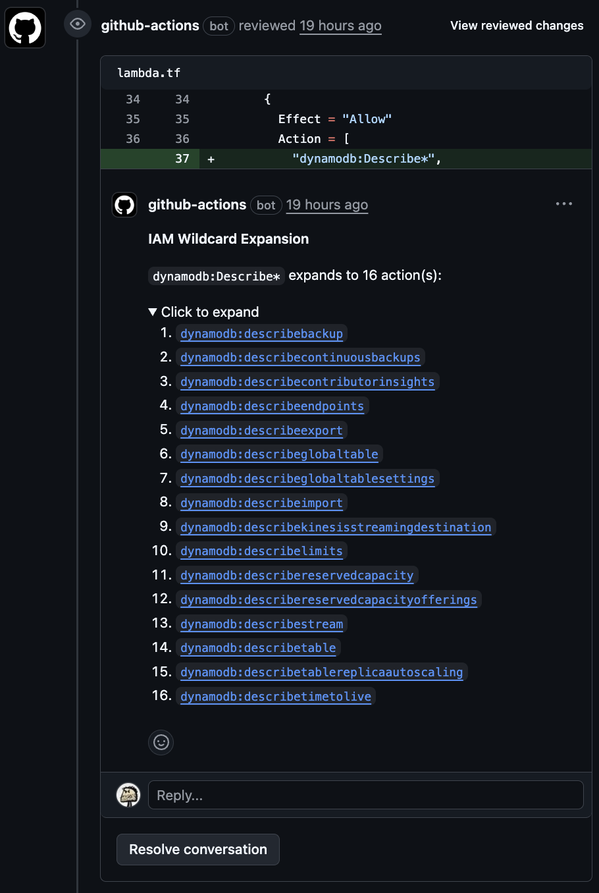

# Expand AWS IAM Wildcards

[](https://github.com/thekbb/expand-aws-iam-wildcards/actions/workflows/ci.yml)
[](https://codecov.io/gh/thekbb/expand-aws-iam-wildcards)
[](https://opensource.org/licenses/MIT)

Automatically expands IAM wildcard actions in PR diffs and posts inline comments showing what
each wildcard matches, with links to AWS docs.

The goal is to make it easier and faster for reviewers to understand changes to security posture with inline comments
like this:



## Recommended Workflow

```yaml
# .github/workflows/iam-wildcards.yml
name: Expand IAM Wildcards

on:
  pull_request:

permissions: {}

jobs:
  expand:
    permissions:
      pull-requests: write
    runs-on: ubuntu-latest
    steps:
      - uses: thekbb/expand-aws-iam-wildcards@v2.0.0
```

That is the recommended setup:

- trigger on `pull_request`, not `pull_request_target`
- grant only `pull-requests: write` to the job that runs this action

No checkout step is required. The action reads the PR diff through the GitHub API and posts inline review comments
back to the pull request.

## What It Does

When your PR introduces:

```hcl
"s3:Get*Tagging",
```

The action posts an inline comment:

> **IAM Wildcard Expansion**
>
> `s3:Get*Tagging` expands to 5 action(s):
>
> 1. [`s3:GetBucketTagging`][s3-get-bucket-tagging]
> 2. [`s3:GetJobTagging`][s3-get-job-tagging]
> 3. [`s3:GetObjectTagging`][s3-get-object-tagging]
> 4. [`s3:GetObjectVersionTagging`][s3-get-object-version-tagging]
> 5. [`s3:GetStorageLensConfigurationTagging`][s3-get-storage-lens-configuration-tagging]

<!-- markdownlint-disable MD013 -->
[s3-get-bucket-tagging]: https://docs.aws.amazon.com/service-authorization/latest/reference/list_s3.html#list_s3-action-GetBucketTagging
[s3-get-job-tagging]: https://docs.aws.amazon.com/service-authorization/latest/reference/list_s3.html#list_s3-action-GetJobTagging
[s3-get-object-tagging]: https://docs.aws.amazon.com/service-authorization/latest/reference/list_s3.html#list_s3-action-GetObjectTagging
[s3-get-object-version-tagging]: https://docs.aws.amazon.com/service-authorization/latest/reference/list_s3.html#list_s3-action-GetObjectVersionTagging
[s3-get-storage-lens-configuration-tagging]: https://docs.aws.amazon.com/service-authorization/latest/reference/list_s3.html#list_s3-action-GetStorageLensConfigurationTagging
<!-- markdownlint-enable MD013 -->

Consecutive wildcards are grouped into a single comment. Expanded actions link to AWS documentation.
Very large expansions are truncated in the PR comment to stay within GitHub comment limits,
and the full list is written to the workflow run logs.

Each run reports matching diff files as analyzed, binary, empty, missing patch
text, or failed analysis. Missing or malformed patch data triggers a
full-PR-diff fallback. If files remain unresolved because the fallback is
unavailable or incomplete, the action reports an incomplete-analysis warning,
keeps findings from analyzed files, and preserves stale comments. No-wildcard
messages apply only to the files that were actually analyzed.

The action only updates or removes comments that have its machine marker and an
author matching the configured token. It also recognizes safely shaped comments
from earlier releases so they can be migrated in place without duplicating
threads.

## Inputs

| Name | Description | Default |
| --- | --- | --- |
| `github-token` | GitHub token for API access | `${{ github.token }}` |
| `file-patterns` | Comma-separated glob patterns to scan | `**/*.json,**/*.yaml,**/*.yml,**/*.tf,**/*.ts,**/*.js` |
| `collapse-threshold` | Number of expanded actions before collapsing into details element | `5` |

## Usage Examples

### Terraform Only

```yaml
- uses: thekbb/expand-aws-iam-wildcards@v2.0.0
  with:
    file-patterns: '**/*.tf,**/*.tf.json'
```

### CloudFormation Only

```yaml
- uses: thekbb/expand-aws-iam-wildcards@v2.0.0
  with:
    file-patterns: '**/*.yaml,**/*.yml,**/*.json'
```

## Update Strategy

Prefer an exact semantic release such as `@v2.0.0` after confirming that its
GitHub release is immutable. Immutable releases lock the release-specific tag
to its commit, while semantic references remain eligible for Dependabot
security alerts and security update pull requests.

Use the moving `@v2` reference in repositories you own when you want compatible
releases without pull requests that edit the workflow file. The signed `v2` tag
moves only after the corresponding version release is verified, published, and
immutable.

A full 40-character commit SHA remains the strongest direct pin. Use it only
when that property outweighs GitHub's current limitation that
[Dependabot alerts for Actions require semantic version references](https://docs.github.com/en/code-security/concepts/supply-chain-security/dependabot-alerts#limitations).
SHA consumers must monitor advisories through another process.

Enable Dependabot for GitHub Actions to receive reviewed version or security
update pull requests for exact semantic references:

```yaml
# .github/dependabot.yml
version: 2
updates:
  - package-ecosystem: 'github-actions'
    directory: '/'
    schedule:
      interval: 'weekly'
```

Dependabot version updates can update workflow `uses:` references in
`.github/workflows`. Dependabot security alerts and their security update pull
requests require a semantic version reference for GitHub Actions; SHA-pinned
Actions do not receive those alerts.

Published GitHub releases in this repository are immutable starting with
`v1.2.1`. That means a release-specific tag such as `@v2.0.0` cannot be
retargeted after publication. Major tags such as `@v2` remain intentionally
movable so they can track the latest compatible release. For GitHub's model for
combining immutable releases with movable major tags, see
[Using immutable releases and tags to manage your action's releases](https://docs.github.com/en/actions/how-tos/create-and-publish-actions/using-immutable-releases-and-tags-to-manage-your-actions-releases).

## Release Process

Published releases are prepared and verified in GitHub Actions on Ubuntu.

1. Run `npm run release -- X.Y.Z` from `main` with the target version.
1. Review and merge the resulting `release-candidate/vX.Y.Z` pull request.
1. Return to the release command, or resume it with `--continue`.
1. The command signs the version tag and starts verified publication.
1. After publication, the command verifies the immutable release and moves the
   signed major tag, such as `v2`, to the release commit.

## How It Works

1. Fetches the PR diff
1. Scans added lines for IAM wildcard patterns (`service:Action*`)
1. Expands wildcards against the bundled IAM action list generated from [@cloud-copilot/iam-data](https://github.com/cloud-copilot/iam-data)
1. Posts inline review comments with links to AWS docs
1. Reuses or updates existing bot comments in place when the anchor still matches, to reduce comment churn

## Security & Trust

- **Minimal permissions** - only needs `pull-requests: write`
- **No secrets required** - uses the default `github.token`
- **No checkout required** - the action reads PR files through the GitHub API
- **Verified immutable releases** - signed version tags are rebuilt, attested,
  and made immutable before publication completes
- **Auditable** - the TypeScript source is small and `dist/index.js` is committed
- **No runtime dependency fetches** - IAM action data is bundled at build time and refreshed in this repo separately
- **Linux-generated release bundles** - the `Prepare Release` workflow builds `dist/index.js` on Ubuntu before tagging
- **Verified release commits** - version tags target the exact GitHub-signed and verified release-candidate merge SHA
- **OIDC-backed release provenance** - the `Verify Draft Release` workflow attests the shipped action bundle before publication

## Verify a Release

Published GitHub releases in this repository are
[immutable](https://docs.github.com/en/code-security/concepts/supply-chain-security/immutable-releases#what-immutable-releases-protect)
starting with `v1.2.1`. Earlier releases can still have signed tags, but they will not pass the
immutable-release check. For GitHub's release-integrity guidance, see
[Verifying the integrity of a release](https://docs.github.com/en/code-security/supply-chain-security/understanding-your-software-supply-chain/verifying-the-integrity-of-a-release).

All release tags in this repository are signed with the GPG key whose public half is published at
[`keys/release-signing-key.asc`](keys/release-signing-key.asc).

Fingerprint:

```text
353A AFB2 1CE8 1D84 3634 AD3E DE52 EEA6 AF0D 8779
```

Import the armored public key and authenticate GitHub CLI before running the
helper script at the repository root:

```bash
gpg --import keys/release-signing-key.asc
gpg --show-keys --fingerprint keys/release-signing-key.asc
gh auth status
./verify-release.sh --tag v1.2.4
./verify-release.sh --sha a328eb86c5d294a3bc93ea3c334b9f2ef669efbf
```

`--tag` must be a semver release tag with a leading `v`. `--sha` must be a full 40-character commit SHA. The script
requires an authenticated GitHub CLI, derives the other value automatically, verifies that the semver tag was signed
by the documented release-signing fingerprint, confirms the tag resolves to the same commit, checks its GitHub
web-flow signature, checks that GitHub has a published immutable release for that tag, verifies the GitHub artifact
attestation for `dist/index.js`, and checks that the commit is on `main`. An unavailable required check fails the
verification. That release should have been
prepared from a Linux-generated `release-candidate/vX.Y.Z` commit and published only after the
`Verify Draft Release` workflow attested `dist/index.js`.

For a separate manual cross-check of the GitHub artifact attestation, check out the release tag and verify
`dist/index.js` against this repository and the release verification workflow:

```bash
git checkout v1.2.4
gh attestation verify dist/index.js \
  --repo thekbb/expand-aws-iam-wildcards \
  --signer-workflow thekbb/expand-aws-iam-wildcards/.github/workflows/verify-draft-release.yml \
  --signer-digest a328eb86c5d294a3bc93ea3c334b9f2ef669efbf \
  --source-ref refs/tags/v1.2.4 \
  --source-digest a328eb86c5d294a3bc93ea3c334b9f2ef669efbf \
  --deny-self-hosted-runners
```

For an additional cross-check, you can confirm the same public key is published on
`keys.openpgp.org` for `kevin@thekbb.net`:

```bash
gpg --keyserver hkps://keys.openpgp.org --search-keys kevin@thekbb.net
```

The fingerprint should still match exactly:

```text
353A AFB2 1CE8 1D84 3634 AD3E DE52 EEA6 AF0D 8779
```

## Contributing

See [CONTRIBUTING.md](CONTRIBUTING.md) for development setup.

## Credits

Uses [@cloud-copilot/iam-data](https://github.com/cloud-copilot/iam-data) pinned in package metadata.
The catalog is bundled into the action, so execution does not download IAM data at runtime.
